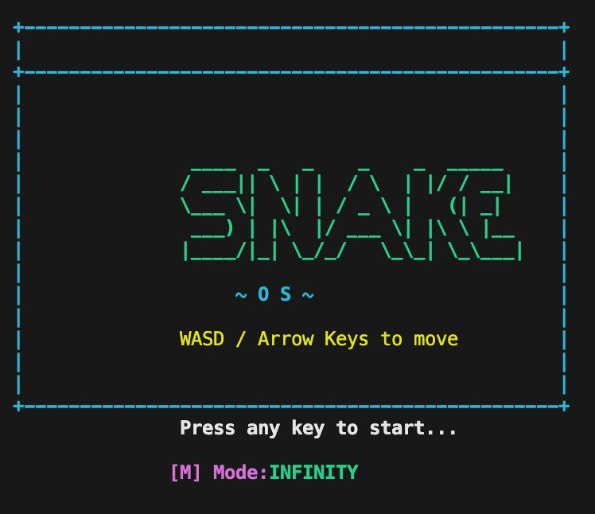
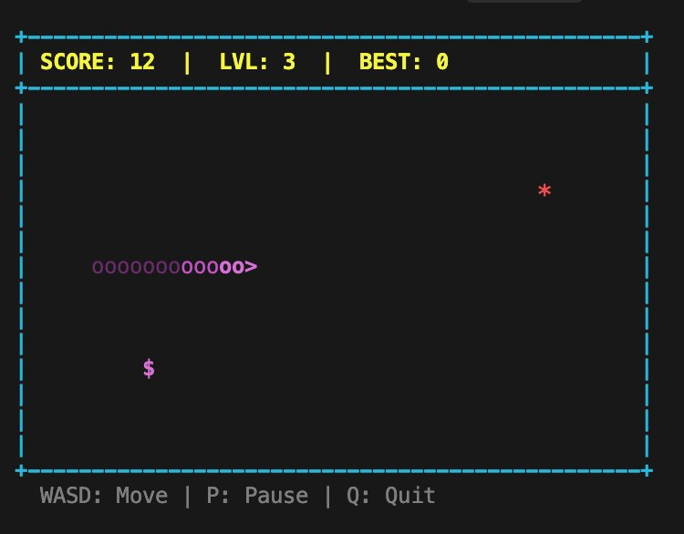

<div align="center">

```
  ██████╗ ███╗   ██╗ █████╗ ██╗  ██╗███████╗      ██████╗ ███████╗
  ██╔════╝████╗  ██║██╔══██╗██║ ██╔╝██╔════╝     ██╔═══██╗██╔════╝
  ███████╗██╔██╗ ██║███████║█████╔╝ █████╗       ██║   ██║███████╗
  ╚════██║██║╚██╗██║██╔══██║██╔═██╗ ██╔══╝       ██║   ██║╚════██║
  ███████║██║ ╚████║██║  ██║██║  ██╗███████╗     ╚██████╔╝███████║
  ╚══════╝╚═╝  ╚═══╝╚═╝  ╚═╝╚═╝  ╚═╝╚══════╝      ╚═════╝ ╚══════╝
```

### *A Bare-Metal, High-Fidelity Terminal Gaming Experience*

[](https://en.wikipedia.org/wiki/C_(programming_language))
[](https://www.linux.org/)
[](LICENSE)
[](Makefile)
[](src/)
[](#version-history)

</div>

---

## Screenshots

**Title Screen**



**Gameplay — Level 3, Score 12, gradient snake with Super food**



---

## Table of Contents

- [About](#about)
- [Features](#features)
- [Architecture](#architecture)
- [Prerequisites](#prerequisites)
- [Installation & Setup](#installation--setup)
- [How to Play](#how-to-play)
- [Project Structure](#project-structure)
- [Module Breakdown](#module-breakdown)
- [Portfolio Frontend](#portfolio-frontend)
- [Version History](#version-history)
- [License](#license)

---

## About

**Snake-OS** is a fully playable Snake game written entirely in **C** that deliberately avoids the C standard library to simulate a bare-metal, OS-like programming environment. Every system layer typically taken for granted has been re-implemented from scratch.

| Standard Approach | Snake-OS Approach |
|---|---|
| `malloc()` / `free()` | Custom First-Fit allocator on an 8 KB `VRAM[8192]` buffer |
| `*`, `/`, `%` operators | Repeated addition / subtraction loops |
| `printf()` / `sprintf()` | Custom `my_int_to_str()` + `write()` syscall |
| `ncurses` / SDL | Raw ANSI/VT100 escape codes written to stdout |
| `rand()` | Tick-counter + prime-number pseudo-RNG |
| Blocking `scanf()` | `termios` raw mode, `VMIN=0 VTIME=0` non-blocking `read()` |

---

## Features

### Gameplay
- **Two Game Modes** — `CLASSIC` (walls kill) and `INFINITY` (walls wrap), toggled with `M` on the title screen
- **Three Food Types** with different point values and timers
  - `*` Normal — +1 point, always present, respawns immediately
  - `+` Bonus — +3 points, timed, flickers before expiry
  - `$` Super — +5 points, rare, very short timer
- **Dynamic Difficulty** — Game speed increases by 5% every time you level up
- **Level Progression** — Level increases every 5 points, cycling the snake's color
- **Pause / Resume** with the `P` key

### Visuals
- **Gradient Snake** — bold → normal → dim cyan tail colouring
- **Direction-Aware Head** — character changes to `^` `v` `<` `>` with movement
- **Live HUD** — `SCORE | LVL | BEST` updated every frame in yellow
- **Death Flash Animation** — screen flashes on game over
- **3-2-1 Countdown** before each game starts
- **Dynamic Board** — auto-resizes with terminal window via `ioctl(TIOCGWINSZ)`
- **Alternate Screen Buffer** — game never corrupts terminal scroll history

### Systems
- Custom **First-Fit memory allocator** with block splitting and coalescing
- Zero standard library dependencies for all game logic
- Loop-based arithmetic (`my_mul`, `my_div`, `my_mod`)
- Singly linked-list snake body — O(1) head insertion
- `atexit()` terminal restoration — terminal always cleaned up on exit

---

## Architecture

```
┌──────────────────────────────────────────────┐
│                  snake.c                     │
│              (Game Engine)                   │
│   game_loop · collision · food · levels      │
└───┬──────────┬─────────┬──────────┬──────────┘
    │          │         │          │
┌───▼───┐  ┌──▼──┐  ┌───▼───┐  ┌───▼──────┐  ┌────────────┐
│memory │  │math │  │string │  │ screen   │  │ keyboard   │
│  .c   │  │ .c  │  │  .c   │  │   .c     │  │    .c      │
│       │  │     │  │       │  │          │  │            │
│8KB    │  │mul  │  │strlen │  │ANSI codes│  │termios raw │
│VRAM   │  │div  │  │strcpy │  │cursor    │  │VMIN=0      │
│alloc  │  │mod  │  │strcmp │  │color     │  │arrow keys  │
│dealloc│  │clamp│  │int2str│  │border    │  │atexit clean│
└───────┘  └─────┘  └───────┘  └──────────┘  └────────────┘
```

---

## Prerequisites

| Requirement | Notes |
|---|---|
| GCC or Clang | C99 or later |
| GNU Make | For Makefile build |
| Linux or macOS | POSIX `termios` + `ioctl` required |
| Terminal emulator | Minimum 40×20 characters recommended |

> **Windows** is not supported natively. Use WSL (Windows Subsystem for Linux).

---

## Installation & Setup

### 1. Clone the Repository

```bash
git clone https://github.com/shahfathalkoul/snake-mini-os.git
cd snake-mini-os
```

### 2. Build

```bash
make
```

Internally runs:

```bash
gcc -Wall -Iinclude \
    src/snake.c src/math.c src/string.c \
    src/memory.c src/screen.c src/keyboard.c \
    -o snake
```

### 3. Run

```bash
./snake
```

### 4. Clean Build Artifacts

```bash
make clean
```

### Troubleshooting

| Problem | Solution |
|---|---|
| `make: command not found` | `sudo apt install build-essential` |
| Terminal looks broken after crash | Run `reset` in your terminal |
| Arrow keys not working | Ensure your terminal supports VT100 sequences |
| Game too fast or too slow | Try a different terminal emulator |

---

## How to Play

### Controls

| Key | Action |
|---|---|
| `W` / `↑` | Move Up |
| `S` / `↓` | Move Down |
| `A` / `←` | Move Left |
| `D` / `→` | Move Right |
| `P` | Pause / Resume |
| `M` | Toggle Mode on title screen (CLASSIC ↔ INFINITY) |
| `Q` | Quit |
| `R` | Restart after game over |

### Difficulty Levels

| Score | Level | What Changes |
|---|---|---|
| 0 | 1 | Base speed, Green Snake |
| 5 | 2 | +5% Speed, Cyan Snake |
| 10 | 3 | +10% Speed, Magenta Snake |
| 15+ | 4+ | Speed continues to scale, Colors cycle (Red, Blue) |

### Food Reference

| Symbol | Name | Points | Behaviour |
|---|---|---|---|
| `*` | Normal | +1 | Always present, instant respawn |
| `+` | Bonus | +3 | Timed — flickers before disappearing |
| `$` | Super | +5 | Rare — very short timer |

---

## Project Structure

```
snake-mini-os/
│
├── src/
│   ├── snake.c        # Game engine — main loop, collision, food, levels
│   ├── memory.c       # Custom First-Fit heap allocator on 8 KB VRAM
│   ├── math.c         # Loop-based mul, div, mod, clamp, abs
│   ├── string.c       # strlen, strcpy, strcmp, int_to_str
│   ├── screen.c       # ANSI rendering, cursor, colours, border
│   └── keyboard.c     # termios raw input, arrow key detection
│
├── include/
│   ├── memory.h       # my_alloc, my_dealloc, memory_init
│   ├── math.h         # my_mul, my_div, my_mod, my_clamp, my_abs
│   ├── string.h       # my_strlen, my_strcpy, my_strcmp, my_int_to_str
│   ├── screen.h       # screen_init, draw_char, set_color, move_cursor
│   └── keyboard.h     # keyboard_init, key_pressed, read_key
│
├── frontend/          # Next.js portfolio site showcasing the project
│   ├── app/
│   ├── components/
│   └── public/
│
├── Makefile
└── README.md
```

---

## Module Breakdown

<details>
<summary><strong>memory.c — Custom Heap Allocator</strong></summary>

Uses a static 8 KB global array `VRAM[8192]` as the entire heap. Every allocation is prefixed by a `BlockHeader` struct containing `size` and `is_free`.

- **`my_alloc(n)`** — First-Fit scan from offset 0; splits oversized free blocks to reduce waste
- **`my_dealloc(ptr)`** — Marks block free; triggers `coalesce_forward()`
- **`coalesce_forward()`** — Iteratively merges adjacent free blocks to prevent external fragmentation
- **`align_up(n)`** — Rounds size to nearest 8 bytes; prevents bus errors on 64-bit systems

</details>

<details>
<summary><strong>math.c — Arithmetic Without */% Operators</strong></summary>

All arithmetic is performed via loops to simulate a minimal instruction-set environment:

- **`my_mul(a, b)`** — Adds `a` exactly `b` times → O(b)
- **`my_div(a, b)`** — Subtracts `b` from `a` until `a < b` → O(a/b)
- **`my_mod(a, b)`** — Returns the remainder of the above → O(a/b)
- **`my_clamp(v, lo, hi)`** — Bounds a value between lo and hi → O(1)
- **`my_abs(a)`** — Returns absolute value → O(1)

</details>

<details>
<summary><strong>string.c — String Operations Without stdio.h</strong></summary>

- **`my_strlen`** — Pointer walk until `\0`; returns byte count
- **`my_strcpy`** — Char-by-char copy with explicit null terminator at end
- **`my_strcmp`** — Returns `(unsigned char)*a - (unsigned char)*b` at first diff
- **`my_int_to_str`** — Extracts digits via `my_mod(n, 10)`, converts with `'0' + digit`, then reverses buffer

</details>

<details>
<summary><strong>keyboard.c — Raw Terminal Input</strong></summary>

Configures terminal via `termios`:
- `ICANON` off — no line buffering, keypress delivered instantly
- `ECHO` off — typed characters not echoed to screen
- `VMIN=0, VTIME=0` — fully non-blocking `read()`
- Arrow keys detected as 3-byte sequences: `ESC (0x1B)` → `[` → `A/B/C/D`
- `atexit(keyboard_restore)` — terminal always restored on exit

</details>

<details>
<summary><strong>screen.c — ANSI Terminal Rendering</strong></summary>

All output via `write()` / `putchar()` using VT100 control sequences:
- `\033[?1049h` — Switch to alternate screen buffer (preserves terminal history)
- `\033[2J` — Clear screen
- `\033[y;xH` — Position cursor at row y, col x
- `\033[Nm` — Set colour (92 = bright green, 36 = cyan, 91 = red, 33 = yellow)
- `ioctl(TIOCGWINSZ)` — Get live terminal dimensions on every frame

</details>

<details>
<summary><strong>snake.c — Game Engine</strong></summary>

- **Linked List Movement** — `tail_push_front` O(1) + `tail_pop_back` O(n) every frame
- **Reverse Prevention** — discards input where `new_dx + dir_x == 0 && new_dy + dir_y == 0`
- **Pseudo-RNG** — `my_mod(my_mul(g_tick, 37) + 17, range)` for food x; prime 53 for y
- **Frame Speed** — `usleep(clamp(150000 - 10000*(score/50), 60000, 150000))` µs

</details>

---

## Portfolio Frontend

The `frontend/` directory contains a **Next.js** portfolio site that showcases this project with:

- Interactive Snake game demo (JS recreation)
- Syntax-highlighted source code explorer
- Architecture visualization
- Responsive, terminal-themed design

### Run the frontend locally

```bash
cd frontend
npm install
npm run dev
```

---

## License

```
MIT License — Copyright (c) 2026 Shah Fathal
```

---

<div align="center">
<strong>Built in pure C — no shortcuts, no libraries, no excuses.</strong>
</div>
